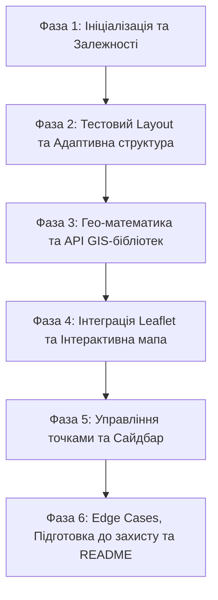

# План реалізації: AgTech GIS Frontend Web App

Детальний план розробки клієнтського веб-застосунку для управління полями та моніторинговими точками згідно з ТЗ.

---

## 🎯 Архітектурний стек та обґрунтування
* **React 18+ (Vite, TypeScript `strict: true`):** швидкість збірки, відсутність `any`, надійна типізація.
* **Leaflet + `react-leaflet`:** декларативне керування шарами мапи, підтримка GeoJSON та кастомних HTML/SVG-маркерів (`L.divIcon`).
* **Zustand:** легковагий стейт-менеджер з точковими селекторами (усуває небажані ререндери важкої мапи).
* **GIS Utilities:**
  * `mgrs` — розрахунок координат MGRS на фронтенді.
  * `@turf/boolean-point-in-polygon` + `@turf/helpers` — точна перевірка знаходження кліку всередині обраного поля.
* **Tailwind CSS + `lucide-react`:** адаптивна верстка (Desktop + Tablet), кастомні іконки маркерів.

---

## 📌 Фази реалізації

---

### 🔹 Фаза 1: Ініціалізація проєкту та залежності
1. **Створення структури Vite React TS:**
   * Шаблон `react-ts`.
   * Налаштування path aliases (`@/*` -> `./src/*`) в `tsconfig.json` та `vite.config.ts`.
2. **Встановлення залежностей:**
   * Продакшн: `leaflet`, `react-leaflet`, `zustand`, `mgrs`, `@turf/boolean-point-in-polygon`, `@turf/helpers`, `lucide-react`, `clsx`, `tailwind-merge`.
   * Дев: `tailwindcss`, `postcss`, `autoprefixer`, `@types/leaflet`, `@types/mgrs`.
3. **Налаштування TypeScript & Стілізації:**
   * Суворі прапорці: `strict: true`, `noImplicitAny: true`, `noUncheckedIndexedAccess: true`.
   * Підключення стилів Leaflet (`leaflet/dist/leaflet.css`) та конфігурація `tailwind.config.js`.

---

### 🔹 Фаза 2: Тестовий Layout (UI каркас Desktop + Tablet)
1. **Компонування екрану:**
   * **Desktop (≥ 1024px):** Двоколонковий сплит — фіксований/адаптивний Сайдбар (380-420px) зліва та інтерактивна Мапа на всю ширину справа.
   * **Tablet / Mobile (< 1024px):** Вкладки швидкого перемикання («Карта» / «Список & Поля») або висувна нижня панель (Drawer).
2. **Базові UI-компоненти:**
   * Картки полів, списки, бейджі типів, пошуковий інпут, модальні вікна.
   * Компонент сповіщень (Toast) для виведення помилок валідації (наприклад: *«Точка повинна бути в межах обраного поля»*).

---

### 🔹 Фаза 3: Гео-математика, Моделі та API складних бібліотек
> 💡 **[AI Research Note: Осі координат]**
> * Leaflet оперує `[lat, lng]`.
> * GeoJSON (RFC 7946), Turf.js та бібліотека `mgrs` приймають `[lng, lat]`.
> * Всі трансформації будуть інкапсульовані та строго типізовані у `src/utils/geo.ts`.

1. **Типізація моделей (`src/types/`):**
   * `Field` (GeoJSON Feature з Polygon, properties: id, name, area, crop).
   * `PointType`: `'SOIL_SAMPLE' | 'PESTS' | 'PLANT_DISEASE' | 'OTHER'` з метаданими (колір, іконка, назва українською).
   * `MonitoringPoint`: `id, fieldId, coordinates { lat, lng }, mgrs, type, description?, createdAt`.
2. **Mock-дані (`src/data/mockFields.ts`):**
   * 3–5 реалістичних полів у форматі GeoJSON згідно зі зразком у ТЗ (площі, культури, валідні замкнені координати полігонів).
3. **GIS-утиліти (`src/utils/geo.ts`):**
   * **Point-in-Polygon:** `isPointInsidePolygon(lat, lng, polygonGeoJson)` через Turf.js.
   * **MGRS конвертер:** `formatWgs84ToMgrs(lat, lng)` через `mgrs.forward([lng, lat])` з форматуванням блоків через пробіли.
   * **Центрування та Bounds:** утиліти для розрахунку `L.latLngBounds` для плавного фокусування `fitBounds`.

---

### 🔹 Фаза 4: Leaflet Map & Інтерактивність
> 💡 **[AI Research Note: Життєвий цикл Leaflet у React]**
> Потрібно забезпечити коректний виклик `map.invalidateSize()` при зміні розмірів контейнера / перемиканні вкладок, щоб уникнути сірих тайлів.

1. **Інстанс мапи:**
   * Рендеринг через `react-leaflet` з підкладкою CartoDB Positron / OpenStreetMap.
   * Допоміжний хук/компонент `MapResizeHandler`.
2. **Візуалізація полів:**
   * Окремі стилі для активного поля (яскравий колір, акцентний бордер) та неактивних полів.
   * Клік по полю на мапі перемикає активне поле у сторі.
3. **Обробка кліків по карті:**
   * Слухач через `useMapEvents`.
   * Перевірка: чи потрапив клік у контур обраного поля?
     * ✅ Так: відкриття модалки додавання точки з предзаповненими Lat, Lng, MGRS.
     * ❌ Ні: показ Toast-сповіщення про помилку.

---

### 🔹 Фаза 5: Маркери, Стейт-менеджмент та Сайдбар
1. **Сховище Zustand (`src/store/`):**
   * `fieldStore`: список полів, `activeFieldId`, селектор активного поля.
   * `pointStore`: список точок (з `localStorage`), фільтри, пошук з debounce, сортування за датою (`desc`/`asc`), CRUD-операції.
2. **Кастомні SVG-маркери (`L.divIcon`):**
   * Векторні іконки під кожен тип: колба (проба ґрунту), жук (шкідники), листок (хвороби), пін (інше).
   * Попап маркера: WGS 84, MGRS, опис, дата створення, кнопка швидкого видалення.
3. **Панель управління (Сайдбар):**
   * Список полів (назва, культура, площа в га, підсвітка активного).
   * Панель фільтрації (Search input, dropdown типу, сортування дати).
   * Список точок: клік по точці плавно центрирує мапу (`map.flyTo`), кнопка видалення точки.

---

### 🔹 Фаза 6: Edge Cases, Підготовка до захисту та README
1. **Обробка крайових випадків:**
   * Збереження точок у `localStorage` (збереження стану після перезавантаження).
   * Empty states для порожніх списків і невдалих результатів пошуку.
2. **README.md (40% оцінки згідно з ТЗ):**
   * Інструкція запуску.
   * Обґрунтування рішень (чому Zustand, як вирішено Point-in-Polygon, чому `divIcon`).
   * Секція: *«Що б ви додали, якби мали більше часу»* (кластеризація, експорт у CSV/GeoJSON, заміри площ/відстаней).
